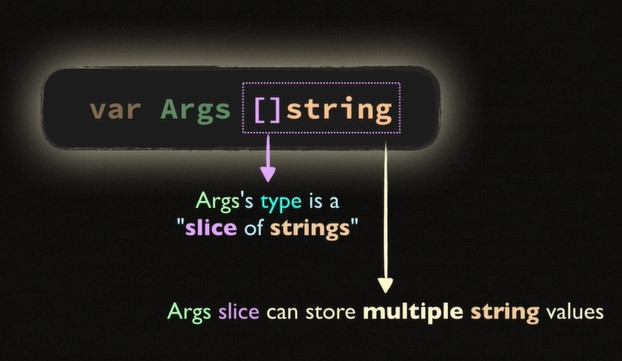
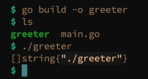

##Intro to slice

```go 
var Args []string
```

- When you run a Go program
- Go puts the command line arguments into this variable automatically
  <br/>

    

  <br/>
- By adding ```[]``` Args variable becomes slice
- Slice means args variable can store number of strings inside it. 
- To access args values we use ```Args[0], Args[1], Args[2]```
- ```Args[0] ``` stores path of the program **../exe/main**

```go
//greeter.go

package main

import (
	"fmt"
	"os"
)

func main() {
	fmt.Printf("%#v\n", os.Args)
}
```
In terminal this program will show if no argument is passed
